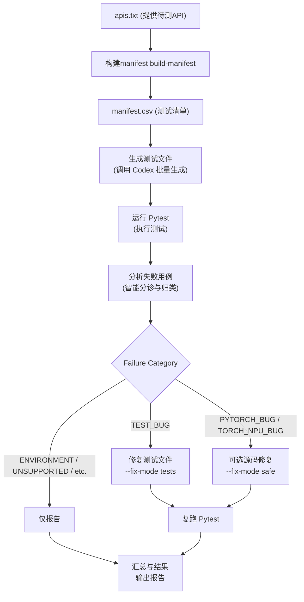

# PyTorch NPU API 自动测试流水线 (PTA Testcase)

本仓库致力于自动化生成、执行、分析和修复 PyTorch NPU API 的功能测试用例。通过一条完整的处理流水线，我们将指定的 PyTorch API 转换为可在 NPU 上稳定运行的 `pytest` 用例，并对其执行结果进行智能分析与低风险修复。

## 核心目标与规范

- **一 API 一文件**：每个 API 仅生成一个独立的测试文件，并统一存放在 `test/api_test/` 目录下。
- **自动分析与精准修复**：内置流程会自动对测试失败结果进行分类（如 `TEST_BUG`, `PYTORCH_BUG` 等）。默认只对测试代码本身的问题进行安全修复，避免盲目修改算子或底层逻辑。
- **NPU 专属**：所有生成的测试必须基于 `torch_npu` 在 NPU 设备上运行。
- **功能覆盖优先**：验证 API 可调用性、输出设备及异常场景，着重于全维度入参覆盖，不强制进行精度对比。

详见完整的仓库和开发约束：[AGENTS.md](./AGENTS.md)。

## 工作流 (Pipeline workflow)

本仓库不只是生成测试代码的脚本，而是一套包含闭环的作业流。默认的执行链路如下：



### 流水线步骤解析：
1. **输入阶段**：解析 `apis.txt` 生成 `manifest.csv`。过滤出状态为 `pending` 的 API。
2. **生成阶段**：调用 Codex 智能批量生成目标测试文件。
3. **执行阶段**：自动运行 pytest 收集测试结果，保存 stdout/stderr 日志及 JUnit XML 报告。
4. **分析阶段**：对失败用例（Failed）进行诊断和分类（Triage）。
5. **修复阶段**：根据指定模式，自动化修复发现的问题：
   - `--fix-mode tests`：仅修复测试本身的问题 (`TEST_BUG`)。
   - `--fix-mode safe`：在安全的情况下，尝试修复框架源码带来的明确 Bug。
6. **回归与总结**：复跑受影响的用例，整理最终汇总产出至 `runs/` 目录。

## 快速开始

可以通过 `scripts/run_api_batch.sh` 或直接用 Python 模块调用流水线。

**推荐命令：**
```bash
python -m scripts.pipeline run --input apis.txt --fix-mode tests
```

**或者使用快捷脚本：**
```bash
bash scripts/run_api_batch.sh apis.txt --fix-mode tests
```

## CLI 参数说明

使用 `python -m scripts.pipeline run` 时可灵活控制执行的行为：

| 参数 | 影响阶段 | 默认值 | 功能描述 |
| --- | --- | --- | --- |
| `--input` | 输入阶段 | 必填 | 数据源文件，支持 `apis.txt` 列表或 `api_manifest.csv`。 |
| `--report-dir` | 工件输出 | `runs/` | 指定构建目录（Run Artifact），默认生成的报告和日志存放于此。 |
| `--resume` | 复用执行 | 无 | 传入已有的 Run 目录路径，以复用上次的执行状态继续运行。 |
| `--skip-generate` | 生成阶段 | `false` | 跳过 Codex 测试文件生成过程，直接复用已有的测试代码执行。 |
| `--max-workers` | 生成阶段 | `8` | 提示 Codex 并发生成请求的预期并行度。 |
| `--run-engine` | 执行阶段 | `codex` | `codex`：交由 Codex 外层执行测试；`local`：本地作为 Python 子进程执行 pytest。 |
| `--analysis-engine` | 分析阶段 | `codex` | `codex`：读取日志进行智能诊断分类；`heuristic`：使用本地启发式规则分类。 |
| `--fix-mode` | 修复阶段 | `tests` | `off`：仅出报告不修复；`tests`：修复 `TEST_BUG`；`safe`：扩展允许修复底层安全 Bug。 |


查看帮助：

```bash
python -m scripts.pipeline run --help
python -m scripts.pipeline build-manifest --help
```

## Quick Start

### 1. 准备 `apis.txt`

每行一个 API，空行和 `#` 注释会被忽略：

```text
# tensor methods
Tensor.new_empty
Tensor.new_zeros

# torch namespace
torch.Event
torch.utils.swap_tensors
```

### 2. 执行默认流水线

```bash
python -m scripts.pipeline run --input apis.txt --fix-mode tests
```

### 3. 查看结果

优先看：

- `runs/<run_id>/manifest.csv`
- `runs/<run_id>/summary.md`
- `runs/<run_id>/analysis_summary.md`
- `runs/<run_id>/results.csv`

## Common Commands

只生成 manifest：

```bash
python -m scripts.pipeline build-manifest --input apis.txt --output api_manifest.csv
python process_api_manifest.py apis.txt api_manifest.csv
```

跑完整默认流程：

```bash
python -m scripts.pipeline run --input apis.txt --fix-mode tests
```

复用已有测试，只重跑执行和分析：

```bash
python -m scripts.pipeline run --input api_manifest.csv --skip-generate --fix-mode off
```

强制本地执行 pytest：

```bash
python -m scripts.pipeline run --input apis.txt --run-engine local --fix-mode tests
```

分析阶段不走 Codex：

```bash
python -m scripts.pipeline run --input apis.txt --analysis-engine heuristic --fix-mode tests
```

允许低风险源码修复：

```bash
python -m scripts.pipeline run --input api_manifest.csv --fix-mode safe
```

## Input Formats

### `apis.txt`

每行一个 API 名称。默认会被转换成一条 manifest 记录，并生成：

- `canonical_name`
- `file_name`
- `status=pending`

### `api_manifest.csv`

至少需要这些列：

```csv
raw_api_name,canonical_name,file_name,status,notes
Tensor.new_empty,Tensor.new_empty,test_Tensor_new_empty.py,pending,
torch.Event,torch.Event,test_Event.py,pending,
```

规则：

- `file_name` 必须是最终测试文件名
- `status=pending` 会进入当前批次
- 如果没有任何 `pending`，流水线会退化为处理全部条目

## Output Artifacts

每次运行都会生成一个独立目录，例如：

```text
runs/20260321T091734Z/
```

关键工件如下：

| 文件 | 说明 |
| --- | --- |
| `manifest.csv` | 本次运行的实时进度表；会随着生成、执行、分析、修复和最终结果持续回写 |
| `pipeline.log` | 外层 pipeline 的阶段日志 |
| `generation_summary.md` | Codex 生成阶段摘要 |
| `pytest_raw/*.command.txt` | pytest 原始命令 |
| `pytest_raw/*.stdout.log` | pytest 标准输出 |
| `pytest_raw/*.stderr.log` | pytest 错误输出 |
| `pytest_raw/*_junit.xml` | JUnit XML |
| `pytest_raw/*.codex.md` | Codex 执行阶段摘要 |
| `analysis_inputs.json` | 提供给分析阶段的结构化输入 |
| `analysis_triage.json` | 分析阶段输出的分类结果 |
| `analysis_summary.md` | 分析阶段的人类可读摘要 |
| `analysis_codex.md` | Codex 分析阶段原始总结 |
| `results.json` | 结构化最终结果 |
| `results.csv` | 表格友好的最终结果 |
| `summary.md` | 最终批次摘要 |
| `fixes/*.request.json` | 单 API 修复请求快照 |
| `fixes/*.md` | 单 API 修复摘要 |
| `fixes/*.stdout.log` | 修复阶段日志 |
| `fixes/*.stderr.log` | 修复阶段错误日志 |

## Failure Classification

当前失败分类包括：

- `TEST_BUG`
- `ENVIRONMENT_MISSING`
- `UNSUPPORTED_ON_NPU`
- `PYTORCH_BUG`
- `TORCH_NPU_BUG`
- `OPERATOR_BUG`
- `API_BEHAVIOR_MISMATCH`
- `FLAKY_OR_UNSTABLE`
- `INSUFFICIENT_COVERAGE`
- `UNKNOWN`

默认修复策略：

- `TEST_BUG`
  默认可自动修复；包括测试代码错误以及使用 `pytest.xfail` 这类策略违规
- `ENVIRONMENT_MISSING` / `UNSUPPORTED_ON_NPU` / `OPERATOR_BUG` / `FLAKY_OR_UNSTABLE` / `INSUFFICIENT_COVERAGE`
  默认只报告，不自动改
- `PYTORCH_BUG` / `TORCH_NPU_BUG`
  仅 `--fix-mode safe` 才允许尝试低风险源码修复

更详细说明见 [docs/failure_taxonomy.md](./docs/failure_taxonomy.md)。

## Recommended Daily Workflow

日常建议按这个节奏使用：

1. 编辑 `apis.txt`
2. 执行 `python -m scripts.pipeline run --input apis.txt --fix-mode tests`
3. 先看 `summary.md` 了解批次整体结果
4. 再看 `analysis_summary.md` 了解失败分类和哪些会被自动修
5. 用 `results.csv` 过滤剩余的环境、框架、算子问题
6. 只有确实接受源码自动修改时，再考虑 `--fix-mode safe`

## Repository Pointers

- [scripts/pipeline.py](./scripts/pipeline.py)
- [scripts/run_api_batch.sh](./scripts/run_api_batch.sh)
- [process_api_manifest.py](./process_api_manifest.py)
- [docs/failure_taxonomy.md](./docs/failure_taxonomy.md)
- [AGENTS.md](./AGENTS.md)
